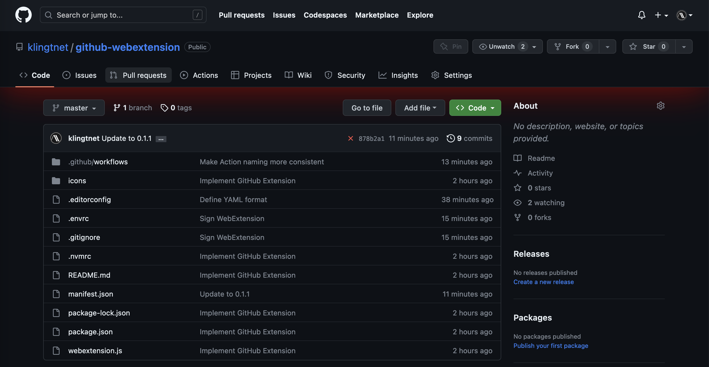

# GitHub Extension

This is a [WebExtension] that indicates whewn you're in a _non_ private GitHub repository.



## Installation

Pick the [latest release](https://github.com/klingtnet/github-webextension/releases/latest) and click on the `*.xpi` asset.  Firefox, or any other browser that supports WebExtensions, should then ask you if you want to install the extension.

## Development

Use [web-ext] for automatic loading and re-loading of the extension.
I recommend [direnv] and [nvm] for the local development setup.
Afterwards you can just run

```sh
$ npm install
```

to install all dependencies.

[direnv]: https://github.com/direnv/direnv
[nvm]: https://github.com/nvm-sh/nvm
[webextension]: bhttps://wiki.mozilla.org/WebExtensions
[web-ext]: https://extensionworkshop.com/documentation/develop/getting-started-with-web-ext/